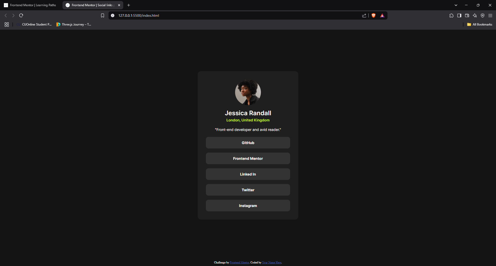

# Frontend Mentor - Social links profile solution

This is a solution to the [Social links profile challenge on Frontend Mentor](https://www.frontendmentor.io/challenges/social-links-profile-UG32l9m6dQ). Frontend Mentor challenges help you improve your coding skills by building realistic projects. 

## Table of contents

- [Overview](#overview)
  - [The challenge](#the-challenge)
  - [Screenshot](#screenshot)
  - [Links](#links)
- [My process](#my-process)
  - [Built with](#built-with)
  - [What I learned](#what-i-learned)
  - [Continued development](#continued-development)
- [Author](#author)

**Note: Delete this note and update the table of contents based on what sections you keep.**

## Overview

This is the solution to the challenge on frontend mentors where I had to design social profile card using HTML and CSS.

### The challenge

Users should be able to:
- See hover and focus states for all interactive elements on the page

### Screenshot



### Links

- Solution URL: [GitHub Repository](https://github.com/FA23BCS233/social-link-profile.git)
- Live Site URL: [https://your-live-site-url.com](https://fa23bcs233.github.io/social-link-profile/)

## My process

### Built with

- Semantic HTML5 markup
- CSS custom properties
- Flexbox

### What I learned

Learn to write the smentic HTML and well structure the markup language to speed up the development process also learned write a good readme files and their basics. Since now I have pushed a lot onto the github I am becoming comfortable in pushing the files on to the github

To see how you can add code snippets, see below:

```html
<main>
    <div class="profile-card">

      <div class="avatar">
        
      </div>
      <h1>Jessica Randall</h1>
      <h2>London, United Kingdom</h2>
      <p>"Front-end developer and avid reader."</p>

      <ul>
        <li><a href="#">GitHub</a></li>
        <li><a href="#">Frontend Mentor</a></li>
        <li><a href="#">Linked In</a></li>
        <li><a href="#">Twitter</a></li>
        <li><a href="#">Instagram</a></li>
      </ul>
    </div>
  </main>
```
```css
main{
    width: 100%;
    height: calc(100vh - 20px);
    display: flex;
    align-items: center;
    justify-content: center;
}

.profile-card{
    max-width: 390px;
    width: 90%;
    display: flex;
    justify-content: center;
    flex-direction: column;
    background-color: var(--gray-800);
    padding: 32px;
    border-radius: 14px;
    font-family: "Inter";
}

.avatar{
    text-align: center;
    margin-bottom: 12px;
}

.avatar img{
    width: 100px;
    border-radius: 50%;
}

.profile-card h1{
    text-align: center;
    font-size: 24px;
    font-weight: 600;
}

.profile-card h2{
    margin-top: 4px;
    text-align: center;
    font-size: 14px;
    color: var(--green);
    font-weight: 600;
}

.profile-card p{
    text-align: center;
    font-size: 14px;
    font-weight: 400;
    margin: 20px 0px;
    color: var(--white);
}

ul{
    list-style: none;
}

ul li:not(:last-child){
    margin-bottom: 16px;
}

li  a{
    display: inline-block;
    width: 100%;
    text-align: center;
    text-decoration: none;
    color: var(--white);
    background-color: var(--gray-700);
    padding: 14px 0px;
    border-radius: 10px;
    font-weight: 700;
    font-size: 14px;
}

li a:hover{
    background-color: var(--green);
    color: black;
}
```

### Continued development

Now I am confident in my basics understanding of the HTML and CSS. Next I hope to make the complete blog page in order to strengthen my concepts and I am seeing myself making a very good portfolio. Countinuing to improve my problem solving skills.


## Author

- Website - [Muhammad Arham](#)
- Frontend Mentor - [@FA23BCS233](https://www.frontendmentor.io/profile/FA23BCS233)

